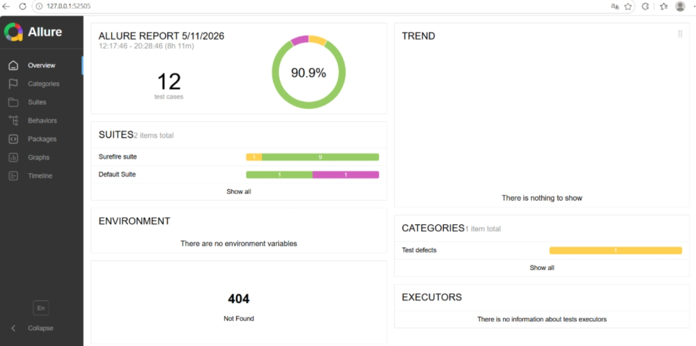

# API Automation Framework

企业级接口自动化测试框架

## 📖 项目简介

基于 **RestAssured + TestNG + Allure** 的接口自动化测试框架，支持：
- HTTP/HTTPS 接口测试（GET/POST/PUT/DELETE）
- 数据驱动测试（Excel）
- 数据库验证
- 全链路业务流程测试
- 美观的 Allure 测试报告

> **注意**：`allure.bat` 是个人环境变量配置文件，其他用户需要根据自己的 Allure 安装路径配置。

## 🛠 技术栈

| 技术 | 说明 |
|------|------|
| Java 17 | 编程语言 |
| RestAssured 5.2.0 | HTTP 接口测试库 |
| TestNG 7.10.2 | 测试框架 |
| Allure 2.27.0 | 测试报告 |
| Apache POI 5.4.0 | Excel 数据驱动 |
| MySQL Connector 8.0.33 | 数据库连接 |
| Lombok | 简化 POJO 代码 |

## 📁 项目结构

```
api-automation-framework/
├── src/
│   ├── main/
│   │   ├── java/com/bytedance/test/
│   │   │   ├── config/          # 配置管理
│   │   │   ├── core/            # 核心封装（请求/响应工具）
│   │   │   ├── pojo/            # 数据对象
│   │   │   └── utils/           # 工具类
│   │   └── resources/
│   │       ├── config/          # 环境配置文件
│   │       └── testdata/        # 测试数据
│   └── test/
│       └── java/com/bytedance/test/
│           ├── base/            # 测试基类
│           └── cases/           # 测试用例
├── pom.xml
└── README.md
```

## 🚀 快速开始

### 1. 环境要求

- JDK 17+
- Maven 3.6+

### 2. 克隆项目

```bash
git clone <your-repo-url>
cd api-automation-framework
```

### 3. 配置环境

复制配置文件模板：
```bash
cp src/main/resources/config/dev.properties.example src/main/resources/config/dev.properties
```

编辑 `dev.properties`，配置你的测试环境：
```properties
base.url=https://jsonplaceholder.typicode.com
login.url=https://jsonplaceholder.typicode.com/login
login.username=your_username
login.password=your_password

db.url=jdbc:mysql://localhost:3306/your_database
db.username=your_db_user
db.password=your_db_password
db.driver=com.mysql.cj.jdbc.Driver
```

### 4. 运行测试

```bash
# 运行所有测试
mvn test

# 运行指定测试类
mvn test -Dtest=PostApiTest

# 指定环境
mvn test -Denv=dev
```

### 5. 查看报告

```bash
# Windows
allure.bat serve target/allure-results

# Linux/Mac
allure serve target/allure-results
```

### 报告预览


## 📝 测试用例说明

### Token 管理测试
- `testGetToken` - Token 自动获取
- `testAuthHeader` - Authorization Header 格式验证
- `testForceRefreshToken` - Token 强制刷新
- `testClearToken` - Token 清除功能

### 帖子接口测试
- `testGetPostById` - 根据 ID 获取帖子
- `testCreatePost` - 创建帖子
- `testApi` - Excel 数据驱动测试
- `testDatabaseConnectionOnly` - 数据库连接验证
- `testPostFullFlow` - 完整 CRUD 流程测试

## 🔧 核心模块

### RequestWrapper
统一请求封装类，简化 HTTP 请求调用：
```java
Response response = RequestWrapper.get("/posts/{id}", Map.of("id", 1));
```

### ResponseExtractor
统一响应提取工具类：
```java
int statusCode = ResponseExtractor.getStatusCode(response);
String title = ResponseExtractor.extract(response, "title");
```

### ConfigManager
多环境配置管理：
```java
// 支持命令行指定环境
mvn test -Denv=test
```

## 📊 测试报告示例

Allure 报告支持：
- ✅ 测试用例通过/失败状态
- 📝 每个步骤的请求和响应详情
- 📈 测试趋势图表
- 🔍 失败原因分析

